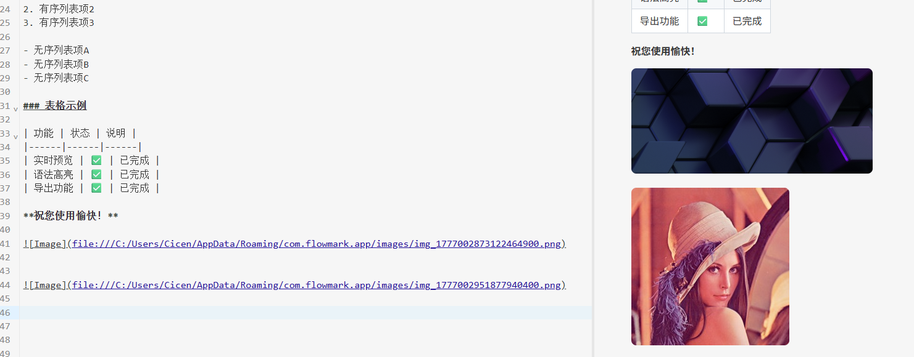
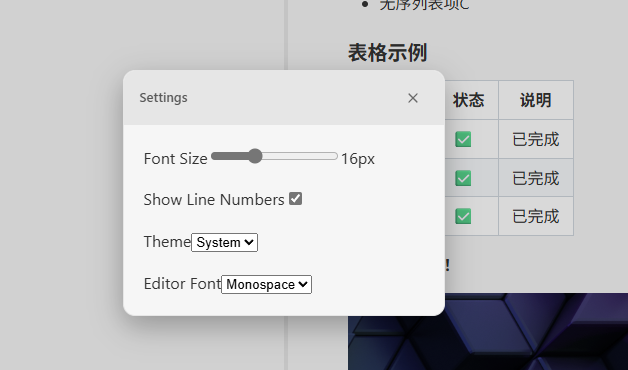
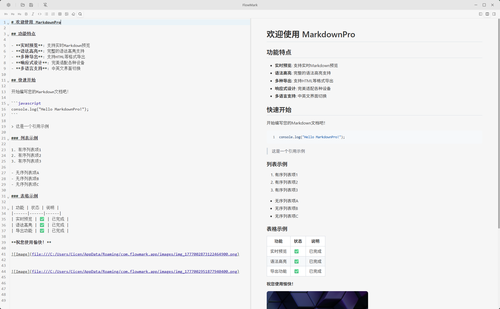

# 🖋️ FlowMark

FlowMark is a professional, high-performance Markdown editor built with **Tauri**, **React**, and **TypeScript**. Designed for writers, developers, and thinkers who demand a zero-distraction, fluid writing experience.



## ✨ Features

- 🚀 **Lightning Fast**: Native performance powered by Rust & Tauri.
- 🎨 **Minimalist Design**: A clean, modern UI that keeps you focused on your words.
- 🌓 **Dynamic Themes**: Seamlessly switch between Light and Dark modes.
- 🖼️ **Intuitive Media**: Simple drag-and-drop or paste image handling that persists across sessions.
- 📝 **Live Preview**: Symmetric, perfectly centered preview for a true "document-like" experience.
- ⌨️ **Productivity First**: Smart shortcuts (Ctrl+S), interactive table generators, and ordered lists.
- 🍱 **Compact & Portable**: Lightweight executable that doesn't bloat your system.

## 📸 Demo Screenshots

| Sidebar & Editor | Preview Mode |
| :---: | :---: |
|  |  |

*(Check the `screenshots` folder for more detailed views of the interface.)*

## 🛠️ Tech Stack

- **Frontend**: React, Vite, CodeMirror 6, Lucide Icons
- **Backend**: Rust, Tauri
- **Styling**: Vanilla CSS (Custom Design System)

## 🚀 Getting Started

### Prerequisites
- Node.js (Latest LTS)
- Rust toolchain

### Installation
1. Clone the repository:
   ```bash
   git clone https://github.com/your-username/flowmark.git
   cd flowmark
   ```
2. Install dependencies:
   ```bash
   npm install
   ```
3. Run in development mode:
   ```bash
   npm run tauri dev
   ```

## 📦 Build Instructions

To generate a production executable for your platform:
```bash
npm run tauri build
```
The compiled EXE will be available in `src-tauri/target/release/`.

## 📄 License

This project is open-source and available under the [MIT License](LICENSE).
